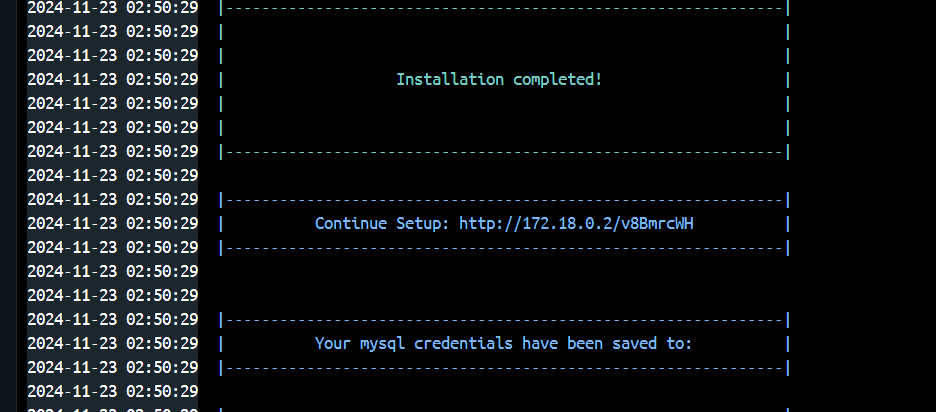

<!-- PROJECT LOGO -->
<br />
<p align="center">
  <a href="https://github.com/LightHaze/xui1">
    
  </a>

  <h3 align="center">XUI.ONE Installer</h3>

  <p align="center">
    A containerized setup for XUI.one using Docker!
    Forked from https://github.com/Itz-Agasta/xui.one-installer.git
  </p>
</p>

<!-- Description -->

This repository provides a fully automated and containerized setup for XUI.one, a comprehensive IPTV panel designed for capturing, delivering, and transcoding video content. It supports various applications, including enterprise video delivery, game streaming, and video-on-demand services. The repository includes all necessary scripts, configurations, and Docker files to deploy XUI.one seamlessly.

## Purpose

1. **Automated Setup:** Automatically installs and configures `XUI.one 1.5.13` on an `Ubuntu 24.04` base image.
2. **Dependency Management:** Installs all required dependencies for XUI.one, including MySQL and other necessary packages.
3. **Persistent Storage:** Creates persistent Docker volumes for MySQL and XUI data to ensure data is not lost between container restarts.
4. **Ease of Use:** Simplifies the deployment process, making it easy to set up and manage XUI.one with minimal manual intervention.


## Getting Started

To get started with the XUI.ONE Installer, follow these steps:

### Prerequisites:

Ensure you have the following installed on your system:

- [Docker](https://docs.docker.com/desktop/setup/install/windows-install/)

### Installation:

1. **Clone the Repository**

   ```bash
   git clone https://github.com/LightHaze/xui1.git
   cd xui.one-installer
   ```

2. **Build and Run the Docker Containers**

   ```bash
   docker-compose up -d
   ```

3. **Access XUI.ONE:** Open your web browser and navigate to the provided url to access XUI.ONE.

   


## Configuration

Data is persisted in two Docker volumes:

- **xui_mysql:** MySQL database files
- **xui_home:** XUI installation files

## Troubleshooting

If you encounter any issues, refer to the logs:

```bash
docker-compose logs
```

## License

This project is licensed under the [MIT License](https://github.com/LightHaze/xui1/blob/main/License). See the LICENSE file for more details.

